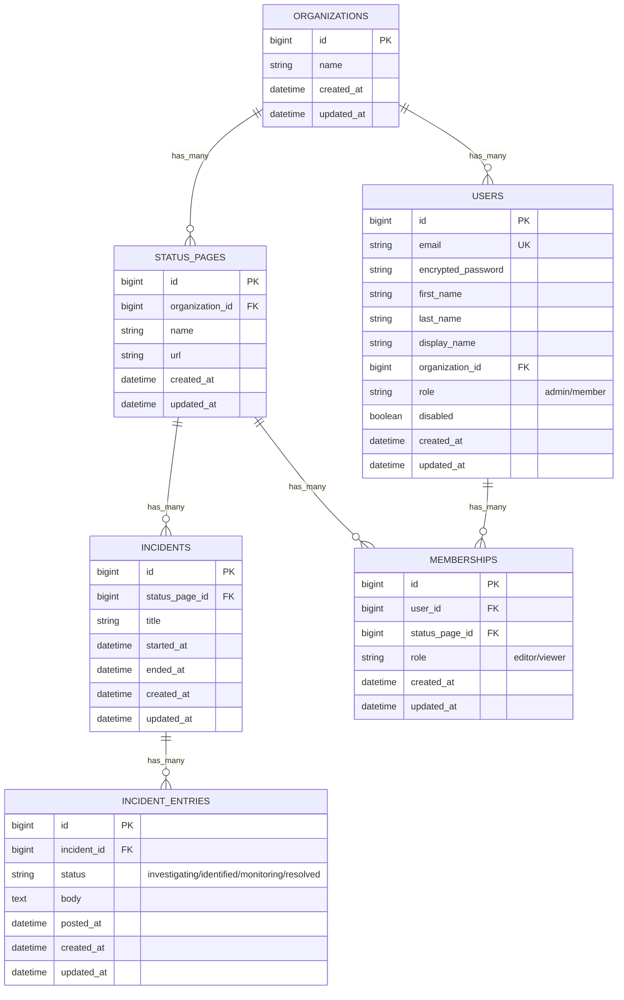

# SolidStatus

A multi-tenant B2B SaaS status page application built with Rails 8.

## Features

- **Multi-tenant architecture** with organization-based isolation
- **Role-based access control** with admin/member organization roles
- **Granular permissions** with editor/viewer status page memberships
- **Incident management** with timeline entries and status tracking
- **Modern UI** with Bootstrap 5, Turbo, and mobile-responsive design

## Technology Stack

- **Ruby** 3.3+ / **Rails** 8.0+
- **PostgreSQL** 17
- **Node.js** 22+ / **Yarn**
- **Bootstrap** 5 with SCSS
- **Turbo** for SPA-like experience
- **RSpec** with Playwright for system tests

## Development Setup

```bash
# Install dependencies and setup database
bin/setup

# Start development server with CSS watching
bin/dev

# Run tests
bundle exec rspec

# Run tests in parallel
bundle exec rake parallel:spec

# Code quality checks
bin/rubocop
bin/brakeman
```

## Architecture

### Database Schema



### Authorization Model

1. **Organization Level**: Users belong to organizations with `admin` or `member` roles
2. **Status Page Level**: Granular access via memberships with `editor` or `viewer` roles
3. **Admin Bypass**: Organization admins have full access to all status pages
4. **Member Restrictions**: Organization members need explicit membership for status page access

## CI/CD

- **GitHub Actions** with PostgreSQL 17
- **Parallel RSpec execution** with database isolation
- **Code quality checks** (RuboCop, Brakeman)
- **Playwright system tests** with Chromium
- **Renovate** for automated dependency updates