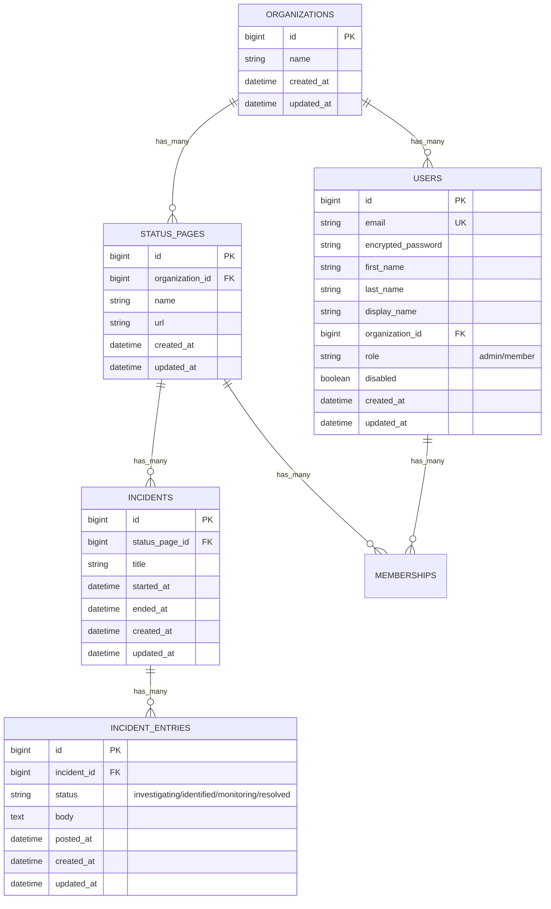

# SolidStatus

A multi-tenant B2B SaaS status page application built with Rails 8.

## Features

- **Multi-tenant architecture** with organization-based isolation
- **Role-based access control** with admin/member organization roles
- **Simple permissions** with organization-level admin/member roles
- **Incident management** with timeline entries and status tracking
- **Modern UI** with Bootstrap 5, Turbo, and mobile-responsive design

## Technology Stack

- **Ruby** 4.0.6 / **Rails** 8.1.3.1
- **PostgreSQL** 17
- **Node.js** 26+ / **Yarn**
- **Bootstrap** 5 with SCSS
- **Turbo** for SPA-like experience
- **RSpec** with Playwright for system tests

## Development Setup

```bash
# Install dependencies and setup database
bin/setup

# Start development server with CSS watching
bin/dev

# Run tests
bundle exec rspec

# Run tests in parallel (setup required first time)
bundle exec rake parallel:setup  # Setup parallel test databases
bundle exec rake parallel:spec   # Run specs in parallel

# Code quality checks
bin/rubocop
bin/brakeman
```

## Architecture

### Database Schema


```mermaid
erDiagram
  ORGANIZATIONS ||--o{ USERS : has_many
  ORGANIZATIONS ||--o{ STATUS_PAGES : has_many

  STATUS_PAGES ||--o{ INCIDENTS : has_many
  STATUS_PAGES ||--o{ MEMBERSHIPS : has_many

  INCIDENTS ||--o{ INCIDENT_ENTRIES : has_many

  USERS ||--o{ MEMBERSHIPS : has_many

  ORGANIZATIONS {
    bigint id PK
    string name
    datetime created_at
    datetime updated_at
  }

  USERS {
    bigint id PK
    string email UK
    string encrypted_password
    string first_name
    string last_name
    string display_name
    bigint organization_id FK
    string role "admin/member"
    boolean disabled
    datetime created_at
    datetime updated_at
  }

  STATUS_PAGES {
    bigint id PK
    bigint organization_id FK
    string name
    string url
    datetime created_at
    datetime updated_at
  }

  INCIDENTS {
    bigint id PK
    bigint status_page_id FK
    string title
    datetime started_at
    datetime ended_at
    datetime created_at
    datetime updated_at
  }

  INCIDENT_ENTRIES {
    bigint id PK
    bigint incident_id FK
    string status "investigating/identified/monitoring/resolved"
    text body
    datetime posted_at
    datetime created_at
    datetime updated_at
  }

```

### Authorization Model

1. **Organization Level**: Users belong to organizations with `admin` or `member` roles
2. **Admin Access**: Organization admins can manage status pages, incidents, and incident entries
3. **Member Access**: Organization members can view all status pages and incidents in their organization

## CI/CD

- **GitHub Actions** with PostgreSQL 17
- **Parallel RSpec execution** with database isolation
- **Code quality checks** (RuboCop, Brakeman)
- **Playwright system tests** with Chromium
- **Renovate** for automated dependency updates
